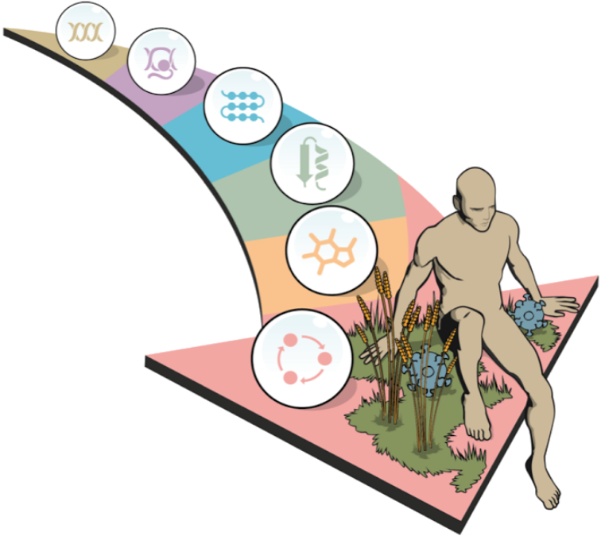

# Qué información tenemos disponible?

|Tipo de datos      |USA                                                   |Europe                                      |
|-------------------|------------------------------------------------------|--------------------------------------------|
|Nucleótidos        |[NCBI nucleotide](http://www.ncbi.nlm.nih.gov/nuccore)|[ENA](http://www.ebi.ac.uk/ena)             |
|Genomas            |[NCBI genomes](http://www.ncbi.nlm.nih.gov/genome)    |[ENSEMBL](http://ensembl.org/)              |
|Datos de expresión |[NCBI GEO](http://www.ncbi.nlm.nih.gov/geo)           |[Expression atlas](http://www.ebi.ac.uk/gxa)|
|Proteínas          |[NCBI protein](http://www.ncbi.nlm.nih.gov/protein)   |[UniProt](http://www.uniprot.org/)          |
|Estructuras 3D     |[RCSB](https://www.rcsb.org/)                         |[PDBe](https://www.ebi.ac.uk/pdbe/)         |
|Compuestos químicos|[PubChem](http://www.ncbi.nlm.nih.gov/pccompound)     |[ChEMBL](http://www.ebi.ac.uk/chembl)       |
|Interacciones      |[MetaCyC](https://metacyc.org/)                       |[Reactome](http://www.reactome.org/)        |
|                   |                                                      |[Intact](http://www.ebi.ac.uk/intact)       |
|Fenotipos          |[OMIM](http://www.omim.org/)                          |                                            |

> El uso de estas bases de datos es gratuito, y la búsqueda de secuencias es relativamente sencillo ya que podemos realizar consultas a través de su sitio web o mediante líneas de comandos

**[Inicio](README.md)**